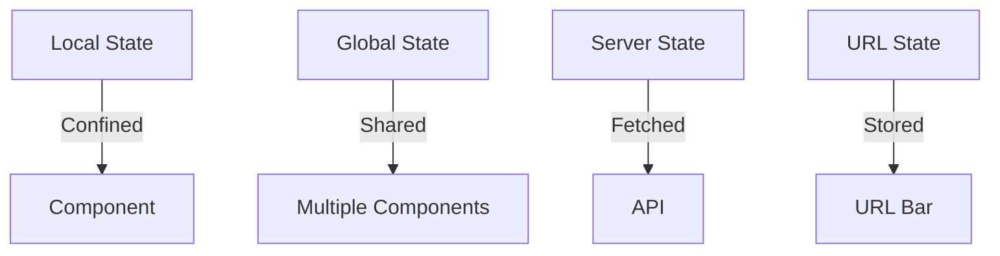

# 1. Understanding State

## Objective

- Understand what state is in web applications
- Learn the different types of state
- See real-world analogies and hands-on demos

---

## What is State?

State is any data that changes over time and **directly affects what your user sees**. For example:

- `isLoggedIn: true/false` → Login button text
- `cartItems: []` → Shopping cart icon counter
- `theme: 'dark'/'light'` → Background color


---

## Types of State

1. **Local State**: Confined to one component (e.g., a checkbox’s `isChecked`)
2. **Global State**: Shared across components (e.g., user authentication)
3. **Server State**: Data fetched from APIs (e.g., product listings)
4. **URL/Route State**: Stored in the URL (e.g., `?page=2` for pagination)



---

## Real-World Analogy

Imagine state as a **traffic light system**. Each light (component) needs to know when to stop, go, or yield. Without coordination (state management), cars (data) crash. Traffic lights ensure smooth flow—just like state management in React!

---

## Hands-On Demo

### Local State Demo

Counter component with `useState`:

```jsx
function Counter() {
  const [count, setCount] = useState(0);
  return <button onClick={() => setCount(count + 1)}>Count: {count}</button>;
}
```

This state is **isolated**—no other component cares about it.

### Global State Demo

Dark mode toggle using React Context:

```jsx
// Context setup
const ThemeContext = createContext();
function App() {
  const [theme, setTheme] = useState("light");
  return (
    <ThemeContext.Provider value={{ theme, setTheme }}>
      <Header />
      <Button />
    </ThemeContext.Provider>
  );
}
// Button component consuming context
function Button() {
  const { theme, setTheme } = useContext(ThemeContext);
  return (
    <button onClick={() => setTheme(theme === "light" ? "dark" : "light")}>
      Toggle Theme
    </button>
  );
}
```

This `theme` state is **global**—multiple components (Header, Button) need it.

**Key Contrast**: Local state is like a notebook for one person; global state is a shared whiteboard everyone can see.

---

## Key Takeaways

- State is data that drives your UI
- Use local state for isolated data, global state for shared data
- Good state management keeps your app predictable and maintainable
