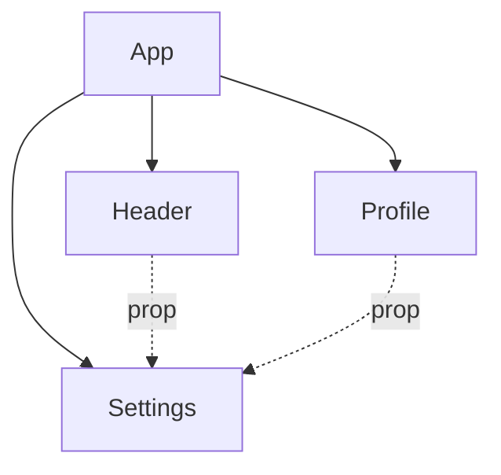

# 2. Why State Management?

## Objective

- Understand why state management is important in modern web apps
- Learn common problems solved by state management
- See practical examples and metaphors

---

## Problem 1: Prop Drilling

Prop drilling happens when you pass state down through multiple layers of components that don’t need it—just to get it to a deeply nested child.

**Example:**

```jsx
<App>
  <Header theme={theme} />
  <Profile theme={theme} />
  <Settings theme={theme} onThemeChange={setTheme} />
</App>
```

Here, `Header` and `Profile` don’t use `theme`—they’re just middlemen.



**Metaphor:** Prop drilling is like handing a letter through 10 people to reach the recipient. One person drops it, and the whole chain breaks.

---

## Problem 2: Inconsistent State

When state isn’t centralized, components can show conflicting data. Imagine a shopping cart icon in the header saying ‘3 items’ and the checkout page saying ‘2 items’—confusing!

**Example:**

```jsx
// Header.js
const [cartItems] = useState([...]);

// Checkout.js
const [cartItems] = useState([...]);
```

**Fix:** We need a **single source of truth**—like global state—to keep everyone in sync.

---

## Problem 3: Scalability

As apps grow, state becomes a tangled web. For example, an e-commerce app with intertwined state: user auth, cart, inventory, and recommendations.

**Example:**

```jsx
// Messy state in a component
const [user, setUser] = useState(...);
const [cart, setCart] = useState(...);
const [inventory, setInventory] = useState(...);
const [recommendations, setRecs] = useState(...);
```

**Metaphor:** Untangled state is like a neatly organized toolbox. Tangled state is a junk drawer—you know the screwdriver’s in there somewhere, but good luck finding it.

---

## Key Takeaways

- State management prevents prop drilling and inconsistent data
- Centralized state makes apps scalable and maintainable
- Use global state for shared data, local state for isolated data
