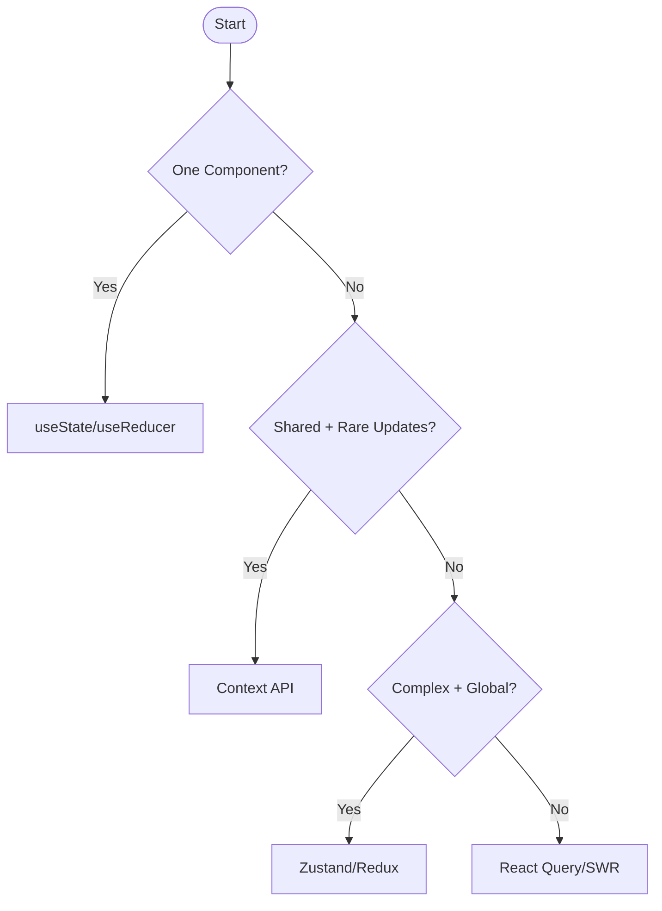

# 4. Strategy Use Case

## Objective

- Learn how to choose the right state management strategy for different scenarios
- See practical flowcharts and real-world examples

---

## Decision Flowchart

Ask these questions in order:

1. **Is the state used in one component?** → `useState`/`useReducer`
2. **Is the state shared but rarely updated?** → Context API
3. **Is the state complex and shared globally?** → Zustand/Redux
4. **Is the state from a server?** → React Query/SWR

**Key Takeaway:** Start simple and escalate only when needed. Don’t over-engineer!



---

## Real-World Scenarios

### Scenario 1: Theming (Context API)

**Demo:**

```jsx
// ThemeContext.js
const ThemeContext = createContext();
function App() {
  const [theme, setTheme] = useState("light");
  return (
    <ThemeContext.Provider value={{ theme, setTheme }}>
      <Navbar />
      <Button />
    </ThemeContext.Provider>
  );
}
```

**Why Context?** Rare updates, shared across many components.

---

### Scenario 2: E-Commerce Cart (Zustand/Redux)

**Demo:**

```jsx
// Zustand store
const useCart = create((set) => ({
  items: [],
  addItem: (item) => set((state) => ({ items: [...state.items, item] })),
}));
```

**Why Zustand/Redux?** Complex cart logic, shared globally, frequent updates.

---

### Scenario 3: Real-Time Dashboard (React Query + Zustand)

**Demo:**

```jsx
// Fetch data with React Query
const { data } = useQuery("sales", fetchSalesData);
// Store UI state (e.g., filters) in Zustand
const { filters } = useDashboardStore();
```

**Why Mix?** Server state (React Query) + UI state (Zustand).

---

## Key Takeaways

- Use the simplest tool that fits your needs
- Combine tools when necessary—server and client state often need separate handling
