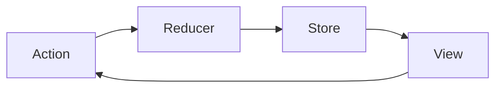

# 6. Redux & Zustand

## Objective

- Understand the core concepts of Redux and Zustand
- Learn how to implement state management with both libraries
- Compare their usage and best practices

---

## Introduction

Redux and Zustand are popular state management libraries for React. Redux is known for its predictability and large ecosystem, while Zustand is lightweight and easy to use.

---

## Redux

Redux is a predictable state container for JavaScript apps. It helps you manage application state in a single, immutable store.



### Key Concepts
- **Store**: Holds the state of your app
- **Actions**: Plain objects describing what happened
- **Reducers**: Pure functions that specify how the state changes
- **Dispatch**: Sends actions to the store

### Basic Redux Example

```js
// store.js
import { createStore } from 'redux';

// Reducer
function counter(state = { count: 0 }, action) {
  switch (action.type) {
    case 'INCREMENT':
      return { count: state.count + 1 };
    case 'DECREMENT':
      return { count: state.count - 1 };
    default:
      return state;
  }
}

// Create store
const store = createStore(counter);

// Dispatch actions
store.dispatch({ type: 'INCREMENT' });
console.log(store.getState()); // { count: 1 }
```

### React Integration

```jsx
// Counter.js
import React from 'react';
import { useSelector, useDispatch } from 'react-redux';

function Counter() {
  const count = useSelector(state => state.count);
  const dispatch = useDispatch();

  return (
    <div>
      <button onClick={() => dispatch({ type: 'DECREMENT' })}>-</button>
      <span>{count}</span>
      <button onClick={() => dispatch({ type: 'INCREMENT' })}>+</button>
    </div>
  );
}
```

---

## Zustand

Zustand is a small, fast, and scalable state-management solution using simplified hooks.

### Key Concepts
- **Store**: Created with a hook
- **Selectors**: Functions to read state
- **Mutators**: Functions to update state

### Basic Zustand Example

```js
// store.js
import { create } from 'zustand';

const useStore = create(set => ({
  count: 0,
  increment: () => set(state => ({ count: state.count + 1 })),
  decrement: () => set(state => ({ count: state.count - 1 }))
}));
```

### React Integration

```jsx
// Counter.js
import React from 'react';
import { useStore } from './store';

function Counter() {
  const count = useStore(state => state.count);
  const increment = useStore(state => state.increment);
  const decrement = useStore(state => state.decrement);

  return (
    <div>
      <button onClick={decrement}>-</button>
      <span>{count}</span>
      <button onClick={increment}>+</button>
    </div>
  );
}
```

---

## Comparison

| Feature         | Redux                | Zustand              |
|----------------|----------------------|----------------------|
| Boilerplate    | High                 | Low                  |
| DevTools       | Excellent            | Good                 |
| Ecosystem      | Large                | Small                |
| Learning Curve | Steep                | Gentle               |
| Performance    | Good                 | Excellent            |

---

## Best Practices

- Use Redux for large, complex apps with many contributors
- Use Zustand for small/medium apps or when you want simplicity
- Keep state minimal and focused
- Avoid unnecessary re-renders by using selectors

---

## References
- [Redux Documentation](https://redux.js.org/)
- [Zustand Documentation](https://zustand-demo.pmnd.rs/)

---

## Key Takeaways

- Choose the right tool for your app's needs
- Simplicity and scalability are both important!