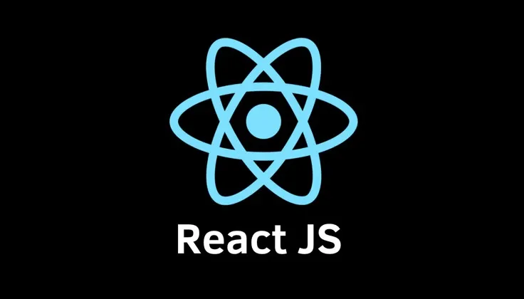

# Introduction to React

### **Workshop Title:** Introduction to React

Presentation Canva : [intro React](https://www.canva.com/design/DAGlBxBYEzk/4YaLFauv99W7eyifBt_YzA/edit?utm_content=DAGlBxBYEzk&utm_campaign=designshare&utm_medium=link2&utm_source=sharebutton)

For explication : [Excalidraw](https://excalidraw.com/)

### **Objectives:**

By the end of this workshop, you will:

- Understand the fundamentals of React and its advantages over traditional JavaScript.
- Learn how to set up a React project and structure components.
- Explore JSX, props, state, and event handling.
- Build a simple React application.

---

### **Course Plan**

### **1. Introduction to React**

- What is React?
- Why use React? (Comparison with vanilla JS & frameworks like Angular, Vue)
- How react work (v-dom)
- Key features of React

[ Introduction to React ](./intro.md)

### **2. Setting Up the Environment**

- Installing Node.js and npm
- Creating a new React project using Vite or Create React App ..
- Understanding project structure

[Setting Up the Environment](./set-up.md)

### **3. JSX & Components**

- What is JSX? (Differences from JavaScript)
- Functional vs. Class Components
- Props and component communication

[JSX & Components](./jsx-and-components.md)

### **4. State & Event Handling**

- Understanding `useState`
- Understanding `useEffect`
- Handling user interactions (onClick, onChange)
- Updating the UI dynamically

[**State & Event Handling**](./state-and-event.md)

### **5. Q & A**

[**Questions & Answers**](./state-and-event.md)

---

### 

### 3. Combien de façons existe-t‑il pour démarrer un projet React ?

Il y a plusieurs “starter kits” et outils, chacun avec ses avantages :

| Outil / Boilerplate | Description |
| --- | --- |
| **Create React App (CRA)** | Opinionated, prêt à l’emploi, sans configuration manuelle. |
| **Vite** | Ultra-rapide, moins “lourd” que CRA, support TS/JSX out‑of‑the‑box. |
| **Next.js** | React + rendu hybride SSR/SSG + routage basé sur le filesystem. |
| **Gatsby** | Générateur de sites statiques, riche écosystème de plugins. |
| **Parcel** | Bundler “zero config”, plus simple que Webpack pour démarrer vite. |
| **Manuel (Webpack / Rollup)** | Full‑control, pour apprendre, mais demande de config (loaders, plugins). |

> En résumé :
> 
> 1. **Pour débuter vite** : CRA ou Vite.
> 2. **Pour un blog/SSG** : Gatsby.
> 3. **Pour un vrai site/SEO/SSG + SSR** : Next.js.
> 4. **Pour personnaliser à fond** : config Webpack/Rollup manuelle.